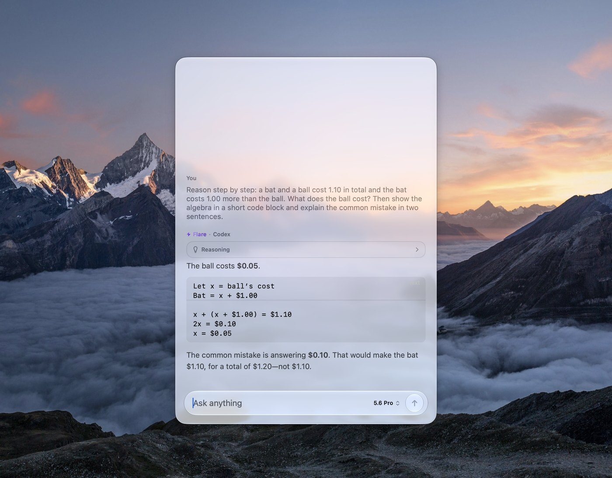
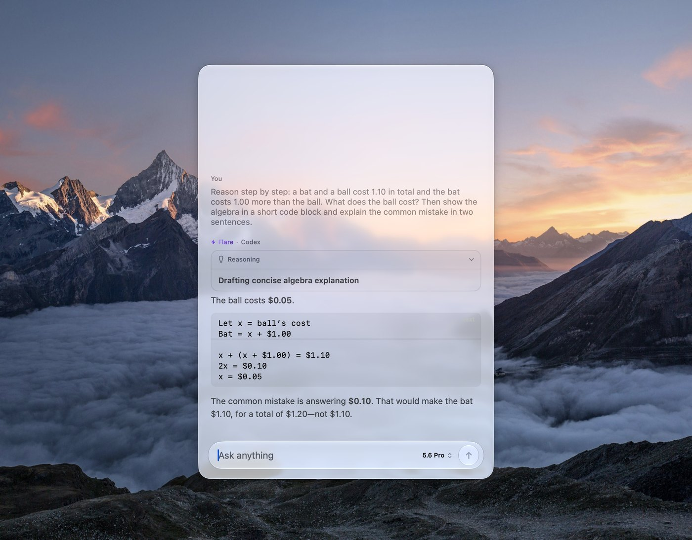
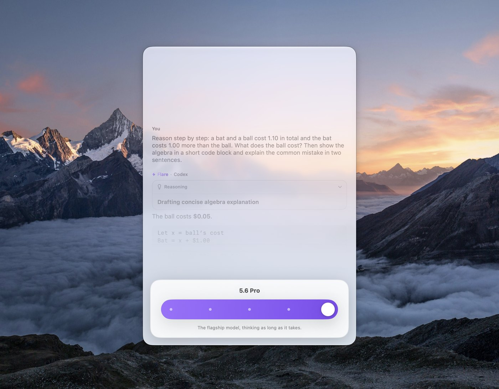
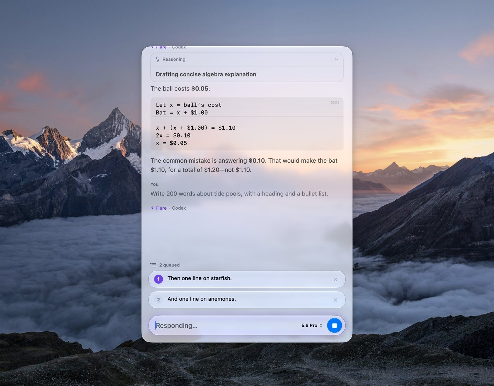
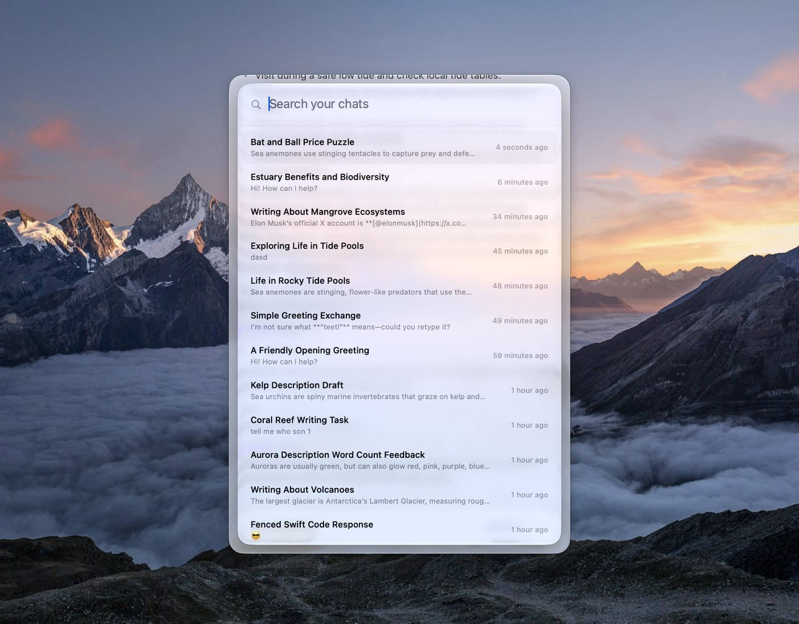
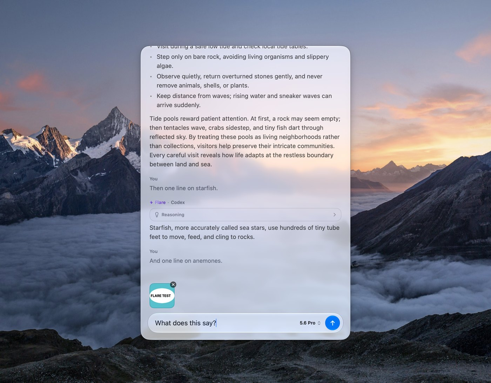
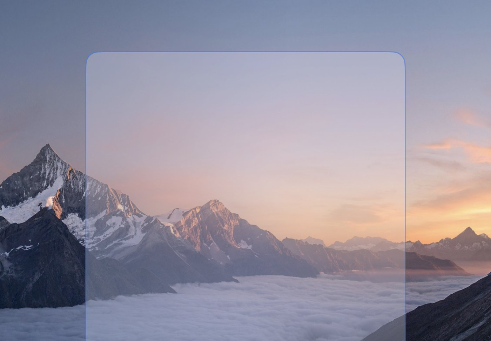

<p align="center">
  
  <h1 align="center">Flare for macOS</h1>
</p>

<p align="center">
  A floating AI chat for your Mac. Press ⌘⇧Space in any app, ask, and keep going. Every chat stays on your Mac.
</p>

<p align="center">
  <a aria-label="Download Latest Version" href="https://github.com/Aayush9029/Flare/releases/latest">
    
  </a>
  <a aria-label="Website" href="https://aayush9029.github.io/Flare/">
    
  </a>
</p>

<p align="center">
  
</p>

## Install

```bash
brew install --cask aayush9029/tap/flare
```

Or download the DMG from [Releases](https://github.com/Aayush9029/Flare/releases/latest). Flare needs macOS 26 or later. Every build is signed and notarized.

## What it does

| | |
|---|---|
|  |  |
| **Answers stream as Markdown.** Headings, lists, tables, and highlighted code, rendered in one text view per reply so long answers stay smooth. | **Reasoning, the way you want it.** A card shows the model thinking, then folds to "Thought for Ns". Short thoughts unfold in place; long ones open across the panel. |
|  |  |
| **One slider for effort.** The chip names the model and its effort. Click it to set how long the model thinks. | **Keep typing.** Messages sent while a reply streams wait their turn, numbered and removable, and go out as replies land. |
|  |  |
| **⌘K searches everything.** Full-text search over every message, with a thumbnail for chats that carry an image. | **Drop or paste an image.** It travels with your message and stays on the chat. |

<p align="center">
  
</p>

**Make it yours.** Choose where the panel opens and how large, drag it anywhere and it reopens there, hide the menu bar icon, and watch a ghost of the panel on your desktop while you decide.

## Providers

Sign in with ChatGPT and your subscription drives the chat, with no API key and no metered billing. Flare uses the same sign-in as the Codex CLI. You can also use your own key for OpenAI, Anthropic, Groq, Gemini, or OpenRouter, or any Chat Completions server such as Ollama or LM Studio.

## Build from source

You need Xcode 26 and [Tuist](https://tuist.dev).

```bash
git clone https://github.com/Aayush9029/Flare.git
cd Flare
tuist install
tuist generate
```

Run the `Flare` scheme. To sign with your own team, change `DEVELOPMENT_TEAM` in `Project.swift`.

## License

[MIT](LICENSE)
